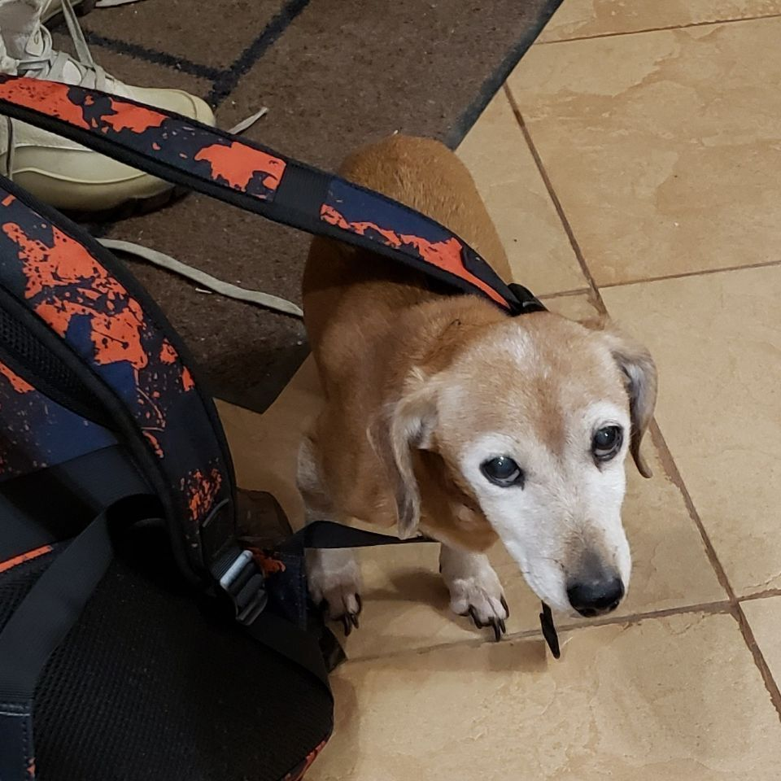
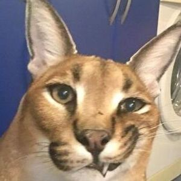
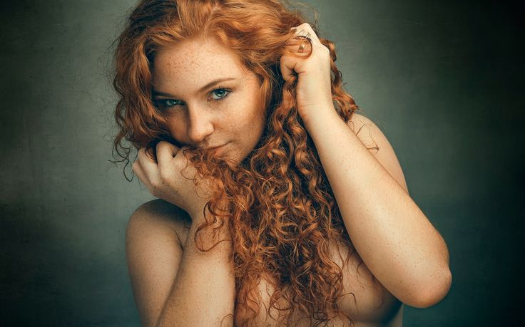
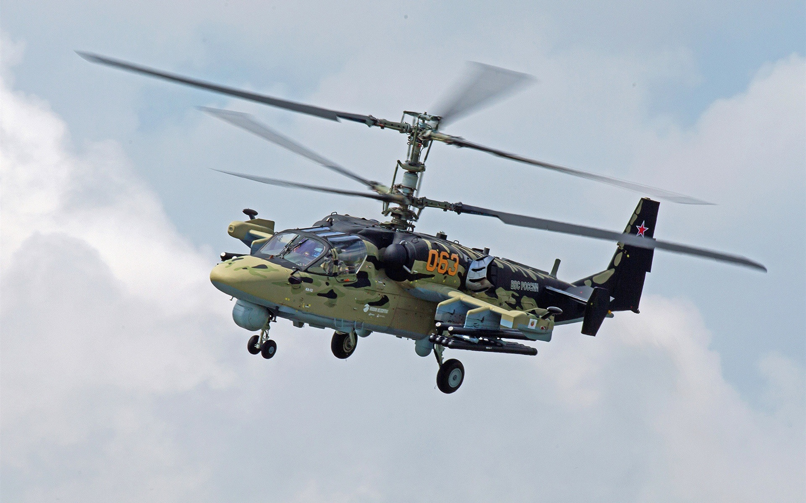
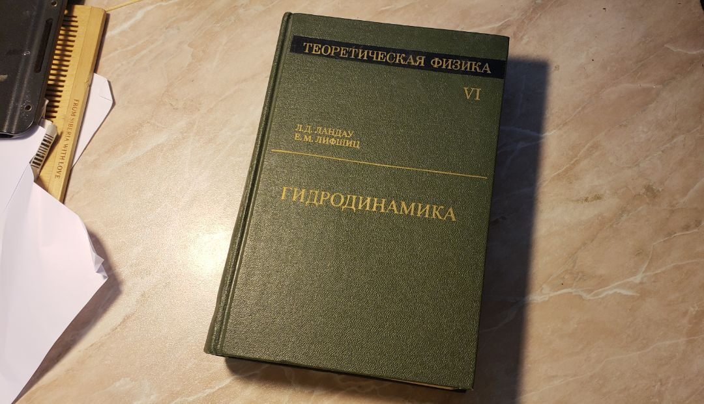
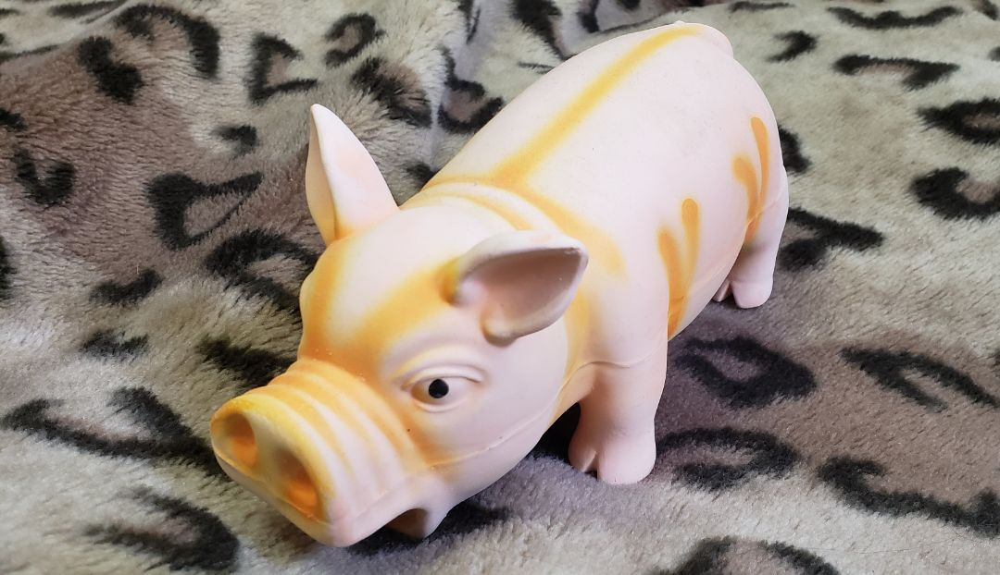
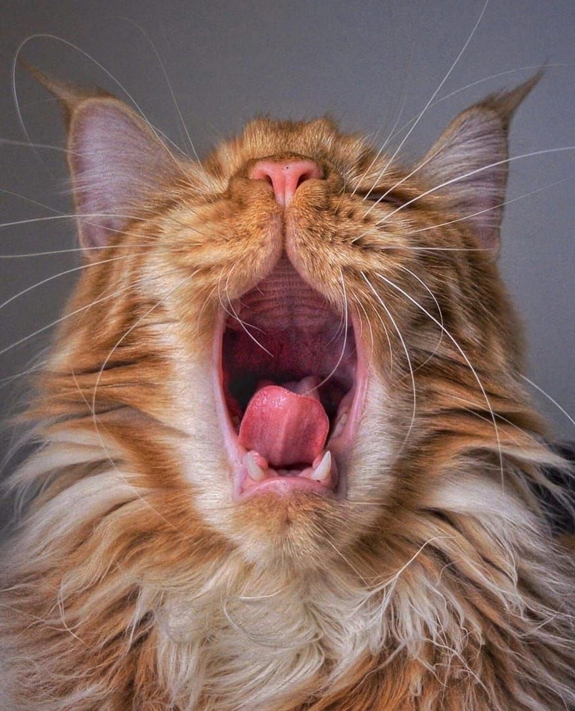
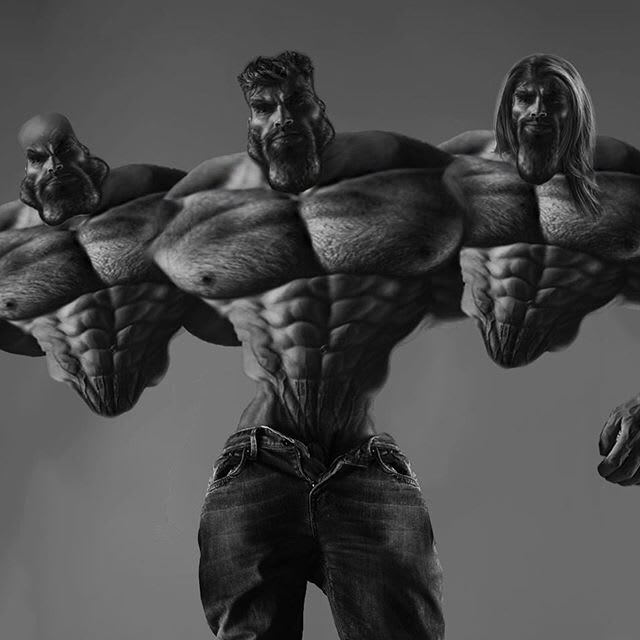

# wc3icons
This repository is final project for 2022 spring DLS season.
The idea is to train generative adversarial network to
turn any picture into Warcraft III icon.

# Data
Most of the icons to train on are taken from
[here](https://www.moddb.com/games/warcraft-iii-frozen-throne/addons/wow-icons-for-war3).
These are not actual wc3 icons -- these are adjusted World of Warcraft icons.
The rest of icons are actual wc3 icons taken from
[here](https://wowpedia.fandom.com/wiki/Wowpedia:Warcraft_III_icons/Icon_list).
Only icons for buttons were eventually used, which turned out to be
unnecessary, but it doesn't seem to be a huge loss anyway.

There are 22529 of adjusted WoW icons and 1007 of wc3 icons, 23536 overall.

Non-wc3 pictures are taken from several datasets:
1. [fruits](https://www.kaggle.com/datasets/moltean/fruits)
2. [dogs and cats](https://www.kaggle.com/competitions/dogs-vs-cats/data?select=train.zip)
3. [monkeys](https://www.kaggle.com/datasets/slothkong/10-monkey-species?select=training)
4. [fashion](https://www.kaggle.com/datasets/paramaggarwal/fashion-product-images-dataset)
5. [buildings](https://www.kaggle.com/datasets/dumitrux/architectural-styles-dataset?select=architectural-styles-dataset)
6. [weather](https://data.mendeley.com/datasets/4drtyfjtfy/1)
7. [food](https://www.kaggle.com/datasets/trolukovich/food5k-image-dataset?select=training)
8. [animals](https://www.kaggle.com/datasets/virtualdvid/oregon-wildlife)
9. [faces](https://drive.google.com/file/d/1KWPc4Pa7u2TWekUvNu9rTSO0U2eOlZA9/view?usp=sharing)

Datasets were only used partially, there are
243 photos of fruits and vegetables, 5050 of dogs and cats,
1097 of monkeys, 4518 of fashion items, 3523 of buildings,
1127 of landscapes, 1500 of food and 1500 of non-food,
5272 of animals and finally 3143 of faces.
Which is 26973 photos overall.

# Preprocessing
Each non-icon was cropped, resized to $56 \times 56$ and shadowed at the edges.
Each icon was cropped to $56 \times 56$ to remove frame.
TODO links to archives.

# Models
Two models were tested. One is
[pix2pix-like](https://arxiv.org/abs/1611.07004) and can be found
in [pix.py](pix.py), the other one mixes pix2pix with
[dense-net](https://arxiv.org/abs/1608.06993v5)
and can be found in [dense\_pix.py](dense\_pix.py).

# Training
There are three train loops, all can be found in [train\_util.py](train\_util.py).
Loss functions were chosen to be MSE, rather than BCE.

## Simple train loop
First one is simple train loop:
1. make transformator generate icons from photos
2. train discriminator on real icons and fakes
3. make transformator generate icons from photos
4. train transformator

## Cycle train loop
Is inspired by [CycleGAN](https://arxiv.org/abs/1703.10593).

Train forward and backward transformator and discriminator
as in simple train loop with addition to cycle consistency loss.
Cycle consistency loss is MSE.

## Harmonic train loop
Is inspired by [HarmonicGAN](https://arxiv.org/abs/1902.09727).

Train forward and backward transformator and discriminator
as in simple train loop with addition to harmonic loss.
Unlike the original, cycle consistency loss is ignored here.
The intention here is to preserve trained model from
"willing" to preserve pictures unchanged.
To calculate harmonic loss, each picture was split into 16 cells
($4 \times 4$).
The implementation of harmonic loss can be found in [harmonic\_loss.py](harmonic\_loss.py).

## Pretraining
In some cases, in order to initialize weights, transformators were for 1 epoch
(pre)trained in autoencoder manner with L1 loss function.

## Parameters
Inspired by [DCGAN](https://pytorch.org/tutorials/beginner/dcgan_faces_tutorial.html),
learning rates were chosen to be
$10^{-4}$ for transformators and $10^{-5}$ for discriminators,
betas were chosen to be $(0.5,\,0.999)$.

## GAN trickery
Labels (real and fake) were flipped (which is seemingly useless in case of
MSE loss, but MSE loss is later addition, so label flip is kind of legacy).

Labels were sampled from uniform distributions
$\mathcal{U}\left(0, 0.15\right)$ and $\mathcal{U}\left(0.85, 1\right)$.

When training discriminator, transformator weights were randomly chosen
from last 7 epochs.

When transformator loss exceeded $0.8$, it was given extra iterations
(not more than 3) to train.

# Test
The following pictures were used for testing:

[link](https://i.pinimg.com/736x/90/0a/b7/900ab76cf0c3b2fe8683e0e2039beb00.jpg)

[link](https://www.pinterest.com/pin/strategic-covering-women-model-redhead-freckles-face-curly-hair--483714816208425154/)

[link](https://www.wallpaperbetter.com/wallpaper/810/134/410/ka-52-helicopter-russian-1080P-wallpaper.jpg)

[link](https://i.pinimg.com/736x/df/ef/52/dfef52bc718c0e35ded5ad5eb80da4bb.jpg)

[link](https://cdn.substack.com/image/fetch/w_1456,c_limit,f_auto,q_auto:good,fl_progressive:steep/https://bucketeer-e05bbc84-baa3-437e-9518-adb32be77984.s3.amazonaws.com/public/images/68ce3fc6-7790-4875-986f-03af22d56395_640x640.jpeg)

# Results
TODO

